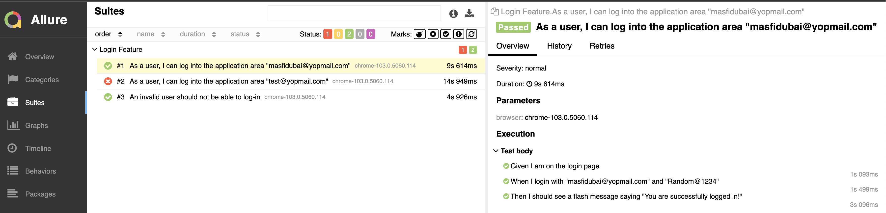

# webdriverio-appium-allure-example

JavaScript browser automation framework using official [webdriverIO](https://webdriver.io/) and [cucumber-js](https://github.com/cucumber/cucumber-js "view cucumber js documentation").

**Table of Contents**

- [webdriverio-appium-allure-example](#webdriverio-appium-allure-example)
  - [Repository setup](#repository-setup)
  - [Usage](#usage)
    - [Options](#options)
    - [Feature files](#feature-files)
    - [Step definitions](#step-definitions)
    - [Reports](#reports)
    - [Directory structure](#directory-structure)
    - [Mobile App Testing](#mobile-app-testing)
    - [Installation](#installation)
      - [<u>**Local Execution:**</u>](#ulocal-executionu)
      - [<u>**Cloud Execution:**</u>](#ucloud-executionu)
    - [VSCode Cucumber Plugin](#vscode-cucumber-plugin)


## Repository setup

- Clone the repository
- Set the correct node version via NVM (optional but recommended)
  ```sh
  # brew command to install nvm
  $ brew install nvm
  # pick the node version from .nvmrc and install the version
  $ nvm install
  # use the node version which is compatible
  $ nvm use
  ```
- Run below command to configure dependencies

  ```sh
  npm install
  ```

## Usage
```bash
npm test
or
npm run test -- --browser=chrome --headless
```

### Options

By default tests are run using Google Chrome, to run tests using another browser supply the name of that browser along with the `--browser` switch. Available options are:

Browser    | Example
---------- | ---------------
Chrome     | `-- --browser=chrome`
Firefox    | `-- --browser=firefox`

### Feature files

A feature file is a Business Readable, Domain Specific Language file that lets you describe software’s behaviour without detailing how that behaviour is implemented. Feature files are written using the Gherkin syntax and must live in a folder named **features** within the root of your project.

```gherkin
# ./features/login.feature

Feature: Login Feature

  Scenario Outline: As a user, I can log into the application area "<username>"
    Given I am on the login page
    When I login with "<username>" and "<password>"
    Then I should see a flash message saying "<message>"

    Examples:
      | username               | password    | message                         |
      | masfidubai@yopmail.com | Random@1234 | You are successfully logged in! |
      | test@yopmail.com       | Random@1234 | You are successfully logged in! |

```

### Step definitions

Step definitions act as the glue between feature files and the actual system under test.

```javascript
// ./step-definitions/login.steps.js

Given(/^I am on the login page$/, async () => {
    await LoginPage.open()
});

When(/^I login with "([^"]*)" and "([^"]*)"$/, async (username, password) => {
    await LoginPage.login(username, password)
});

Then(/^I should see a flash message saying "([^"]*)"$/, async (message) => {
    await expect(HomePage.flashAlert).toBeExisting();
    await expect(HomePage.flashAlert).toHaveTextContaining(message);
});
```

### Reports

HTML and JSON reports are automatically generated and stored in the default `./reports` folder. 



### Directory structure

You can use the framework without any command-line arguments if your application uses the following folder structure:

```bash
.
├── features
│   └── login.feature
├── step-definitions
│   └── login.steps.js
├── page-objects
│   └── home.page.js
│   └── login.page.js
└── reports
    ├── allure-report
    └── allure-results
```
### Mobile App Testing

The same framework is designed to test mobile app version of the application.
### Installation
To run the tests on local, you need to install simulator/emulator of respective mobile devices.
>#### <u>**iOS Simulator Setup**</u>
>To run the tests on the iOS simulator you need to install [xcode](https://developer.apple.com/xcode/), with this you will be provisioned with preinstalled simulators. If you want to download and install a different version of simulator follow [here](https://www.kindacode.com/article/how-to-install-an-ios-simulator-in-xcode/)

>#### <u>**Android Emulator Setup**</u>
>To run the test on the Android emulator you need to install [android studio](https://developer.android.com/studio/install). Once it's installed, open android studio click on the context menu and select device manager[VDM].

>

>Once the VDM is open, you can select the emulator to run the tests on.

#### <u>**Local Execution:**</u>
Once the devices are installed. Below is the command to run the test on the `local` android emulator and ios simulator

```bash
npm run test:android # command test on android emulator
npm run test:ios # command test on ios simulator
```
You can find the device configuration for [android](config/wdio.android.conf.js) and [ios](config/wdio.ios.conf.js) here.

To generate `allure` report, use below command

```bash
npm run generate:ios-report
npm run generate:android-report
```
#### <u>**Cloud Execution:**</u>

There is also an option to run test on [saucelabs](https://saucelabs.com/) a cloud device provider

```bash
npm run sauce:android # command test on android
npm run sauce:ios # command test on ios
```

### VSCode Cucumber Plugin

Visual Studio Code has also an extension for Cucumber (Gherkin) Language Support + Format + Steps/PageObjects Autocomplete. You can find how to install and use it at [Cucumber (Gherkin) Full Support](https://marketplace.visualstudio.com/items?itemName=alexkrechik.cucumberautocomplete).

Following the default structure, the `settings.json` should look like this:

```json
{
    "cucumberautocomplete.steps": [
        "step-definitions/*.js"
    ],
    "cucumberautocomplete.syncfeatures": "features/*.feature",
    "cucumberautocomplete.strictGherkinCompletion": false,
    "cucumberautocomplete.onTypeFormat": true,
    "editor.quickSuggestions": {
        "comments": false,
        "strings": true,
        "other": true
    },
    "cucumberautocomplete.gherkinDefinitionPart": "(Given|When|Then)\\(",
}